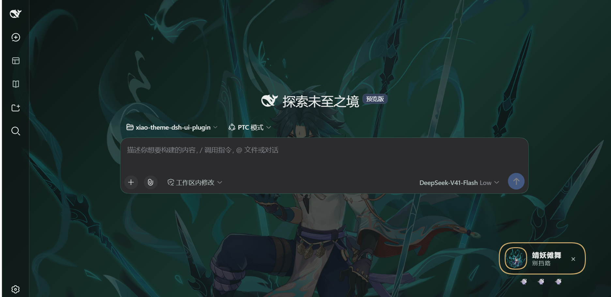
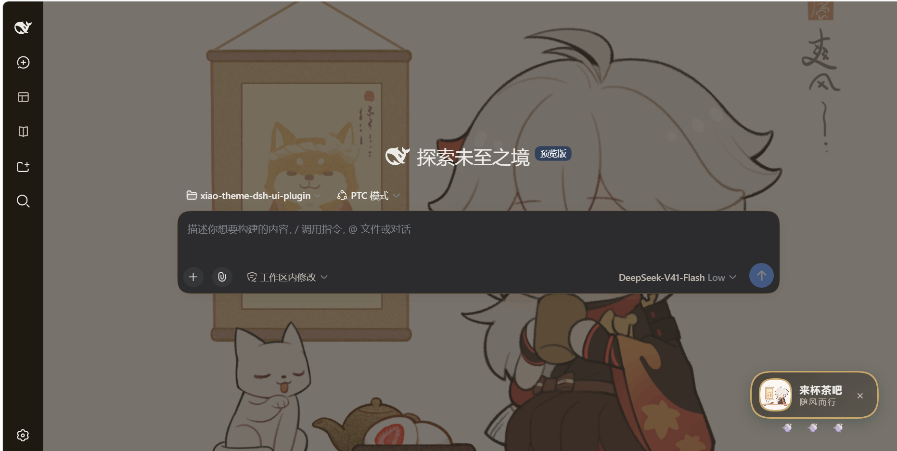
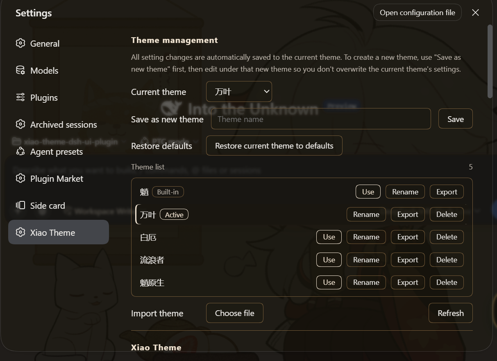
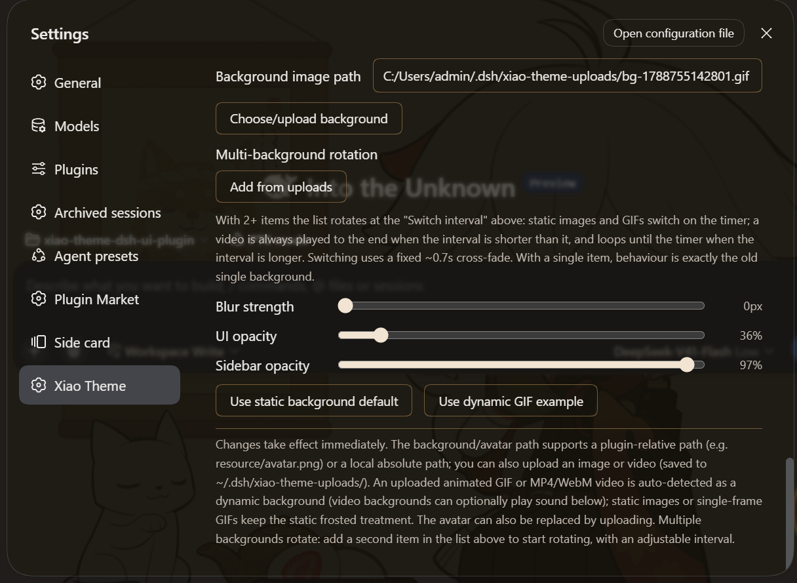

> **Language / 言語：** **English** (current) · [简体中文](./README.zh-CN.md) · [日本語](./README.ja.md) · [한국어](./README.ko.md)

# xiao-ui-theme-ts

A **highly customizable theme plugin** for DeepSeek Harness (ships with a "Xiao" jade-green look by default). It themes the DeepSeek Harness web UI: colors, mascot badge, background, and injected voice are all configurable. The background supports **static images, animated GIFs, and looping videos (MP4/WebM/MOV/M4V)** — an uploaded animated GIF is auto-detected and used as a live/dynamic background, and an uploaded video is auto-detected and played as a full-screen looping background. Out of the box it's a Xiao-style jade/emerald theme, but the accent color, badge text, voice, and background are all tweakable — make it your own.

## What is this

Gives the DeepSeek Harness web UI a heavily customizable theme. **By default it's the jade-green "Xiao" look** (jade palette + mascot badge + Xiao-style voice + frosted background), but every part is adjustable: accent color, badge text, voice toggle/language/content, background image and transparency. It also optionally injects a "Xiao-style voice" into the session — turn it on if you want the assistant to speak like Xiao, off if not. It only changes tone/style, never the substance of the answer. On top of that it ships a **separate roleplay space** (entertainment): an independent, tool-free agent preset for actually chatting in character, kept deliberately apart from work sessions — a work session only ever gets tone, never a character identity.

## Preview

<details open>
<summary><b>Light mode</b></summary>


</details>

<details>
<summary><b>Dark mode</b></summary>



</details>

<details>
<summary><b>Switch to another theme</b></summary>



</details>

<details>
<summary><b>Settings page</b></summary>



</details>

<details>
<summary><b>Settings page (continued)</b></summary>



</details>

## Features

- **Customizable palette (jade/emerald by default)**: light / dark jade palettes; pick the accent with a color wheel, and toggle the theme off from settings.
- **Mascot badge**: a draggable, collapsible badge (bottom-right); title and subtitle can be set to any text, and the avatar image can be replaced by uploading a new one. The avatar also supports animated GIFs — an uploaded GIF plays as an animation with no separate toggle. A **Reset mascot** button restores the avatar path, title and subtitle to their defaults. **With a video background the badge also shows a 🔊/🔇 button** (just left of the close button) for one-click mute/unmute — it is the same switch as "Background video audio" on the settings page, and static or GIF backgrounds never show it.
- **Xiao-style voice (work sessions)**: injects a Xiao-voice instruction into the system prompt (toggleable), with Chinese / English templates or your own custom prompt. **Tone only**: the substance, tools and execution stay exactly the same, and no character identity is injected.
- **Roleplay space (entertainment, off by default)**: a **separate roleplay session**, completely apart from the work session you actually use — nothing is installed until you switch it on, so upgrading never adds a surprise agent preset. When enabled, the plugin turns the role system prompt into its own DSH agent preset (shown as "角色空间（娱乐） / Roleplay (entertainment)"): **DSH 0.1.7 and newer declare it through the `agentPresets` registry**, while **0.1.6 and older write the `~/.dsh/.agent-presets/xiao-roleplay/` directory**. Start a new session and pick that preset at the top to enter character. The default role is an **English Xiao card**, and any full character prompt you paste replaces it. The preset's own composition mounts **no file, command or task tools**, so a roleplay session never gets your work tools and you **never trade away a work session's real capability** for it; the two sides keep separate histories. (Tools registered by profile-level plugins sit outside every preset and still appear — see the notes below.) One-click toggle — turning it off removes the preset.
- **Frosted background**: configurable background image (relative plugin path, local absolute path, or direct upload), with adjustable blur and UI transparency. Uploading an **animated GIF** is auto-detected and used as a **live/dynamic background**; uploading an **MP4 / WebM / MOV / M4V video** is also auto-detected and played as a full-screen looping video background (with an optional sound toggle); static images or single-frame GIFs keep the static frosted treatment.
- **Multiple backgrounds (rotation)**: add a second item to the background list and it starts rotating. Static images and animated GIFs switch on a configurable interval; a video always plays to the end when the interval is shorter than the clip, and loops until the interval when it is longer — the switch time is `max(interval, video length)`. Switching uses a fixed ~0.7s cross-fade. With a single background nothing changes: no timer, no fade, exactly the old behaviour.
- **UI & sidebar transparency control**: UI opacity (0.3–0.9) controls the main content area; sidebar opacity (0–1) independently controls the left/right sidebars, up to 100% fully opaque while always letting part of the background through.
- **Accent color**: jade green by default, or pick any accent via the color wheel; the whole jade palette (panel surfaces, borders, brand color, sidebars, background gradient) shifts in sync, persisted after change. You can also **reset the accent back to the default jade** with one click.
- **Theme management (multi-theme)**: save the current settings as a named theme, switch / rename / delete themes (the built-in "Xiao" theme is protected), reset the current theme back to defaults, and one-click import / export any theme as a `.json` file.
- **Upload asset manager (picker)**: the background / avatar upload controls open a picker window listing everything already uploaded (thumbnail, size, last-modified, which themes reference it) so you can **re-select an existing file to reuse it**, or **upload a new one right there** (auto-selected after it succeeds). An **Open upload folder** button opens the folder in your file manager to add / remove / rename files directly. **Nothing is auto-deleted** — the uploads folder is user-managed.
- **Settings page**: master toggle, accent color, **voice (work sessions)**, template language, custom prompt, **roleplay space (entertainment)** (toggle / allow web lookup / role system prompt / apply-update preset / reset role / open preset folder / install status), avatar path, mascot title/subtitle, theme management, frosted background (on/path/upload/blur/opacity; GIF or MP4/WebM/MOV/M4V video auto-detected as a dynamic background, with a sound toggle for video), UI and sidebar opacity.

## Requirements

- DeepSeek Harness (`dsh` available) — with **`v0.1.5-alpha.1` or newer** (builds that ship the official right panel) **use this release or a later one**; on anything **before `v0.1.5-alpha.1`, use the previous release `0.11.x`** (see [Version compatibility](#version-compatibility))
- better-sidebar (optional third-party plugin) — **`0.19.x` only**; legacy `≤ 0.18` (self-drawn right panel) is not adapted to
- Node.js (≥ 18 recommended)
- [pnpm](https://pnpm.io/)

## Version compatibility

**Pick the theme version by your DSH version — the dividing line is whether the official right panel exists (`dsh-client-ui-sidebar-right`, introduced in `v0.1.5-alpha.1`):**

| Your setup | Install | Notes |
| --- | --- | --- |
| **DSH `v0.1.5-alpha.1` or newer** (ships the official right panel) | **this release `0.12.0` or later (preferred)** | the painting model covers both shapes of the official right panel: the panel paints itself (`v0.1.5-alpha.1` – `0.1.6-alpha.2`), or the panel paints nothing while inner surfaces do (`0.1.7-alpha.1` and newer) |
| **DSH before `v0.1.5-alpha.1`** (no official right panel) | **the previous release `0.11.x`** | that generation's right column and anchors do not line up with this release; the older theme is the safer pick |

> ⚠️ **Picking against the table will not crash**: the plugin still loads and DSH still starts, but **UI bugs may appear** — for example the sidebar / right panel background and transparency can be wrong (too flat, not transparent enough, mismatched between the two sides, or showing the background through entirely).
> - Official right panel (`v0.1.5-alpha.1` or newer) → this release or later.
> - Before `v0.1.5-alpha.1` → the previous release `0.11.x`.
> - The legacy anchors (`data-dsh-panel` / `data-dsh-pane`) are still in the CSS, so an old combination will not error or crash — only the **look is not guaranteed**.

## Install online (quick)

1. Make sure the `dsh` command is available.
2. Install by package name (npm — recommended):
```bash
dsh plugin --profile web add xiao-ui-theme-ts
```
   Or install directly from a GitHub release tarball:
```bash
dsh plugin --profile web add https://github.com/jinxlux/xiao-theme-dsh-ui-plugin/releases/latest/download/xiao-ui-theme-ts.tgz
```

## Install from source (clone)

```bash
git clone <copied-repo-url>
cd xiao-ui-theme-ts

pnpm install       # install build dependencies
pnpm run build     # produce lib/ (ESM Host + ModuleLoader Client + declarations)
pnpm run check     # optional: verify the artifact satisfies the dsh plugin contract
```

Then attach it as a bundle to a DSH profile:

```bash
# relative path (run from a sibling directory)
dsh plugin --profile web add "./xiao-ui-theme-ts"
# or an absolute path
dsh plugin --profile web add "D:/.../xiao-ui-theme-ts"
```

> `dsh plugin add` installs the package into the profile and, thanks to its `dsh.bundle` declaration, **automatically hooks it into the bundle stack** — no manual config needed.
> Refresh / restart DSH Web for the theme to take effect.

## Usage & configuration

- Open DSH Web → **Settings → Xiao Theme**: master toggle, accent color, **voice (work sessions)**, template language, custom prompt, **roleplay space (entertainment)**, avatar path, mascot title/subtitle, theme management, frosted background (on / path / upload / blur / opacity; GIF or MP4/WebM/MOV/M4V video auto-detected as a dynamic background, with a sound toggle for video), UI opacity, sidebar opacity.
- **Voice (work sessions)**: the built-in Chinese/English templates are tone only — the substance, tools and execution stay exactly the same, and no character identity is written into a work session. The **custom prompt is different**: it is inserted verbatim as an extra system-prompt section in **every** work session, so whatever you write really takes effect. Keep it tone-only — tool, permission, identity or "always refuse X" instructions there will degrade your normal sessions.
- **Roleplay space (entertainment)**: its own settings group, deliberately kept apart from the voice prompt:
  - **Toggle** (off by default): turning it on generates / updates the preset from the role text below; turning it off removes the preset (sessions already running on it keep running). The theme's own master switch (**Enable Xiao theme**) also gates it — while that is off nothing is installed and the preset is removed, so "theme off" really means off.
  - **Allow web lookup** (off by default): when on, the roleplay preset mounts exactly one extra model-facing row — DSH's `web_search` / `web_fetch` tools — so the character can look up the latest plot, design and lore before playing. File, command and task access stay blocked. Whatever role text you provide is used verbatim, and the plugin then appends its own short rules section after it — the tool gate for this switch plus the "never name your source" rule. Your role text cannot replace or turn that off, so don't put tool instructions in it: they would only conflict with the appended rules. (A profile-level web plugin, if installed, supplies the search provider — see the notes below.) Looked-up material is only background knowledge for the character: it stays in character and never mentions the web, a search, a source or a link. Off (the default) web lookup is simply not allowed: the role text orders the character to use no tools at all — that block lives in the prompt, not in the tool set.
  - **Role system prompt**: empty uses the built-in English Xiao card; paste any full character prompt to switch roles (saved and synced to the preset automatically).
  - **Apply / update preset**: force a rewrite (useful after hand-editing the generated file).
  - **Reset to default role (Xiao)** / **Open preset folder**: restore the role text, or open the preset directory in your file manager (on 0.1.6 and older that is `~/.dsh/.agent-presets/xiao-roleplay/`; on 0.1.7+ the preset comes from the registry and the folder is created first if missing) in your file manager.
  - **How to enter character**: start a **new session** and pick "角色空间（娱乐） / Roleplay (entertainment)" in the new-session preset chip — DSH only allows switching a preset while a session has produced nothing, so an existing session can never be turned into a roleplay one.
- **Multiple backgrounds**: in Settings → Xiao Theme the background block lists every background. Click "Add from uploads" to open a thumbnail picker and click the images / videos you want (you can upload a new file from that same window); every list item shows its own preview. With two or more items it rotates, and reorder / remove controls plus the "Switch interval" slider appear. "Choose/upload background" still replaces only the **first** item.
- **Accent color**: pick an accent with the color wheel (default jade green `#2E8B72`); the panel surfaces, borders, brand color, sidebars and background gradient all shift in sync. Semantic state colors (error / warning / success) stay fixed and don't follow the accent.
- **Mascot**: badge title (default "靖妖傩舞") and subtitle (default "别挡路") can be set to any text; an empty title falls back to the default. The avatar image path accepts a plugin-relative path or a local absolute path, and you can upload an image directly to replace the avatar. The avatar also supports animated GIFs — an uploaded GIF plays as an animation with no separate toggle.
- **Uploads (picker)**: click "Choose/upload background" or "Choose/upload avatar" to open an asset window — pick an existing upload to reuse it (backgrounds re-derive the dynamic flag automatically), or upload a new one right there; the new file is auto-selected. The **Open upload folder** button lets you manage the files directly. The **Reset theme color** and **Reset mascot** buttons restore those fields to defaults.
- **UI opacity**: controls the main content area, range 0.3–0.9, capped so at least ~10% of the background stays visible.
- **Sidebar opacity**: independently controls the left/right sidebars, range 0–1, up to 100% fully opaque. The left is DSH's own sidebar; the right is DSH's native right-sidebar panel (stable anchor `data-sidebar-right-panel`), which is also exactly where **better-sidebar ≥ 0.19** mounts its tabs — so one slider covers both. Older better-sidebar releases (< 0.19) drew their own panel and are still matched through `data-dsh-panel` / `data-dsh-pane`. When neither is present the rules simply do nothing.
- Changes take effect **immediately**, no DSH restart needed.
- Settings are saved to `xiao-theme.json` under the DSH home — `~/.dsh` by default, `$DSH_HOME` when that is set; uploaded background images/videos go to `xiao-theme-uploads/` right beside it (user-level, not shipped with the repo). An install that already has data at `~/.dsh` keeps using it, so upgrading never looks like a settings reset (see [Notes](#notes)). Uploads are streamed to disk and sized by purpose: avatars/images keep a 20MB cap, backgrounds (including videos) allow up to 200MB. Unsupported or mismatched formats are rejected with a clear message shown in the settings page (instead of silently failing).

## Notes

- **Switching from a local install to a remote install**: if you first installed this plugin from a local path (`dsh plugin add ./xiao-ui-theme-ts`, which DSH stores as a `link:` dependency), then later switch to a remote install (package name or tarball), remove the leftover link first — otherwise pnpm may follow it back to your local `node_modules` and fail with a symlink `EPERM` (`@types/node`). Remove it and retry:
  ```bash
  dsh plugin --profile web remove xiao-ui-theme-ts
  dsh plugin --profile web add xiao-ui-theme-ts
  ```
- **Build before mounting**: `lib/` is build output, not committed. After clone, run `pnpm install && pnpm run build` first, then `dsh plugin add`; adding an unbuilt directory fails because `lib/` is missing.
- Default avatar / background use **in-package relative paths** (`resource/avatar.png`), readable across machines; keep `resource/` at the same level as `lib/` after building (current layout works). `resource/bg.svg` is legacy and no longer used.
- **Video background compatibility**: a loop with the widest support uses H.264 (AVC) + AAC in `.mp4`, or VP8/VP9 in `.webm`. Some browsers can't decode HEVC (H.265) `.mp4`/`.mov`; `.avi`/`.mkv` aren't accepted.
- **Video-background sound needs one interaction per page load**: browsers (Chrome / Edge / Firefox) **always allow muted autoplay** but **block autoplay with sound** until you interact with the page — a page-load-level browser policy, not a plugin setting. So with the sound toggle on, after you start DSH (or refresh the page) the video background starts playing **muted**, and the moment you click anywhere or press a key, the sound comes back on automatically — no need to re-pick a theme. The toggle only expresses *whether you want sound*; it cannot overrule the browser. If you want sound on the very first frame, allow autoplay for the origin (`http://127.0.0.1:3080`) via the `AutoplayAllowlist` enterprise policy, or launch the browser with `--autoplay-policy=no-user-gesture-required` (debug flag). Otherwise just leave the sound toggle off and the background stays purely muted. See [Autoplay policy in Chrome](https://developer.chrome.com/blog/autoplay/).
- The Xiao-voice prompt depends on DSH's `systemPrompt` assembly. If the agent preset filters the prompt down to only a persona, or uses a **complete persona**, the voice may not appear in that session (that's preset behavior, not a plugin bug).
- "Sidebar opacity" targets DSH's own `sidebarCol` column and the native right-sidebar panel (`data-sidebar-right-panel`). Older DSH releases named that column `detailsCol`, and older better-sidebar releases drew their own panel tagged `data-dsh-panel` / `data-dsh-pane`; both anchors are kept for compatibility. The newer better-sidebar **bottom workbench** panel also carries `data-dsh-panel`, so it is explicitly excluded (`:not([data-dsh-bottom-panel])`) and stays opaque. The sidebar rules themselves are CSS-only — the anchors are stable data attributes / class-name suffixes, never hashed class prefixes. (A small JS fallback separately locates the shell frame to apply the frosted-panel blur when the CSS selector misses; it is not used for, and does not affect, the sidebar anchors.)
- **Uploads are user-managed (no auto-delete)**: uploaded files are never deleted automatically, so the folder can grow over time. Use the picker's "Open upload folder" to add / remove / rename files yourself.
- **The voice section can be dropped by a preset**: `xiao-voice` is an ordinary unscoped system-prompt section, not a mode. A preset that filters assembly down to its persona (or sets `complete: true` on it) removes it — so if the tone disappears under a particular preset, that is the preset's behavior, not a broken toggle.
- **The roleplay space registers an agent preset**: while the toggle is on, the plugin picks its route by DSH version — on **DSH 0.1.7+** it declares the preset through the `agentPresets` registry (re-registered the moment the toggle, the role text or **Allow web lookup** changes); on **DSH 0.1.6 and older (web 0.1.5, for instance)** it maintains `agent.cordis.yml` and `preset.yml` under `~/.dsh/.agent-presets/xiao-roleplay/` (`agent.cordis.yml` is generated — do not hand-edit it; change the role through the settings text box instead). Both routes produce an **identical** preset (same persona, same rows). Turning the toggle off releases the registration and deletes those two files (a non-recursive removal, so anything else you placed in that directory is left alone). The preset's persona *is* the complete system prompt (`complete: true` plus no runtime context). Its own composition mounts no work-tool rows (no file, shell, subagent, task or plan), and **Allow web lookup** adds just one row (`web_search` / `web_fetch`). This governs the preset's own layer only: tools registered by **profile-level plugins** (host-plane rows such as a web-search plugin like modsearch, or plugin-vet) belong to no preset and appear in **every** session, roleplay included — the preset cannot hide them. That is a supported setup: leave such a plugin installed if you want the extra reach — its own tools work in a roleplay session, and with **Allow web lookup** on, `web_search` uses the provider it supplies (modsearch does exactly this). Uninstall or disable it from the profile only if you would rather the roleplay session not have it. That root is resolved the way DSH resolves it at the user level — a non-blank `$DSH_HOME` replaces `~/.dsh` — so the file route always lands where DSH scans (on 0.1.7+ the registry route never touches that directory). The theme's own settings and uploads deliberately stay at `~/.dsh`, so upgrading never looks like a settings reset.
- **Roleplay and work sessions never affect each other**: a work session keeps only the tone injection and never receives a character identity; the roleplay session inherits none of the work-session tools (files, shell, subagents, tasks, plans) and only ever searches or fetches the web when **Allow web lookup** is on, so "roleplay erodes real capability" cannot happen — the trade-off is that the roleplay session cannot do your work, which is exactly the boundary an entertainment mode should have. The two keep separate histories and settings.
- **Roleplay content disclaimer**: in a roleplay session the model improvises in character — **do not treat it as technical fact or a source of truth**. No copyrighted script text ships with the plugin; the role text is yours to write (the plugin still appends its own short rules section after it — see the settings above).
- This plugin **does not read environment variables** for configuration; settings come only from `xiao-theme.json` and compile-time defaults. (`$DSH_HOME` is read only to locate that data root, never to configure the theme.)

## License & disclaimers

- **Code**: this repository's source is open-source under the **MIT license** (see `LICENSE`); study, modify, and redistribute as permitted.
- **Images**: `resource/` (bg.svg, avatar.png, plus user-uploaded background images) come from **public online sources**, provided only for demo / customization of this theme.
- **Character & setting**: Xiao and the Genshin Impact character likeness, names, related settings, and art assets are **copyrighted by miHoYo**. The MIT license **covers only this repository's code** and does **not** cover miHoYo's character likeness / setting / original art. Content including related assets (`resource/` and theme showcases) **may not be used commercially or repurposed** without permission. To redistribute or use commercially, obtain a license from miHoYo first; removing or replacing the assets in `resource/` avoids this constraint. See the "Character Image & Setting Intellectual Property Notice" in `LICENSE`.
